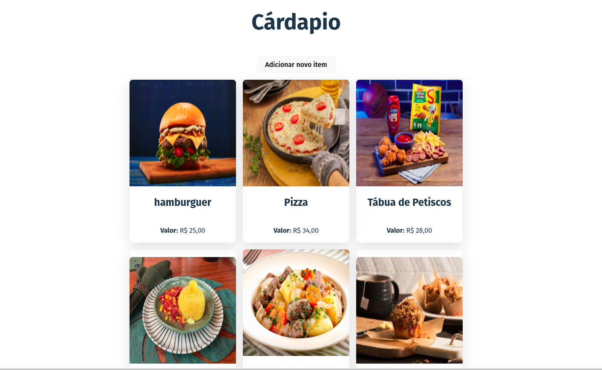
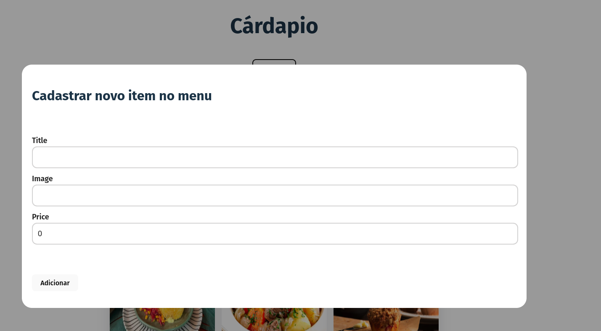

# Estudos de ReactJS e Spring Boot

## Objetivo
* Criar uma aplicação web para estudos de ReactJS e Spring Boot
* A aplicação será um cardápio de restaurante


## Tecnologias
* ReactJS
* Spring Boot
* Java 17 
* Maven
* PostgreSQL

## Requisitos
* Java 17
* Maven
* PostgreSQL

## Como executar o back-end
* Clone o repositório
* Execute o comando `mvn spring-boot:run` na pasta raiz do projeto
* Acesse a aplicação em `http://localhost:8080`

## Como executar o front-end
* Clone o repositório
* Execute o comando `npm install` na pasta `cardapio-front`
* Execute o comando `npm run dev` na pasta `cardapio-front`


## script para criar o banco de dados
```sql
CREATE DATABASE cardapio;

CREATE TABLE foods (
    id SERIAL PRIMARY KEY,
    title VARCHAR(255) NOT NULL,
    image VARCHAR(255) NOT NULL,
    price NUMERIC(10,2) NOT NULL
);

```

## images do projeto



## Referências
* [Spring Boot](https://spring.io/projects/spring-boot)
* [Criando Aplicação Fullstack do Zero com Java Spring e React ](https://www.youtube.com/watch?v=lUVureR5GqI&t=233s)
# reactjs-springboot
# reactjs-springboot
# reactjs-springboot
